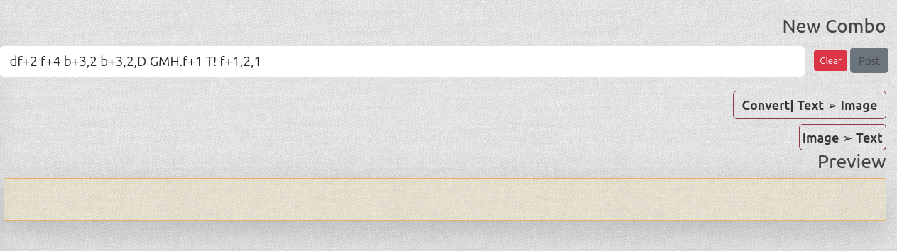
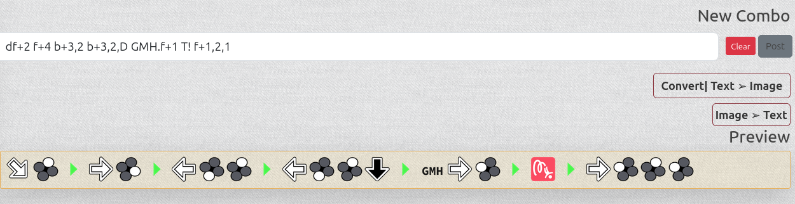
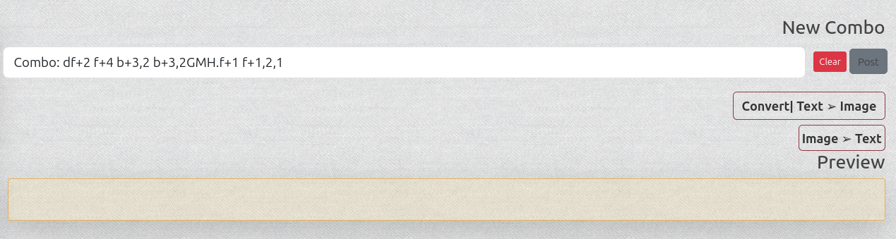
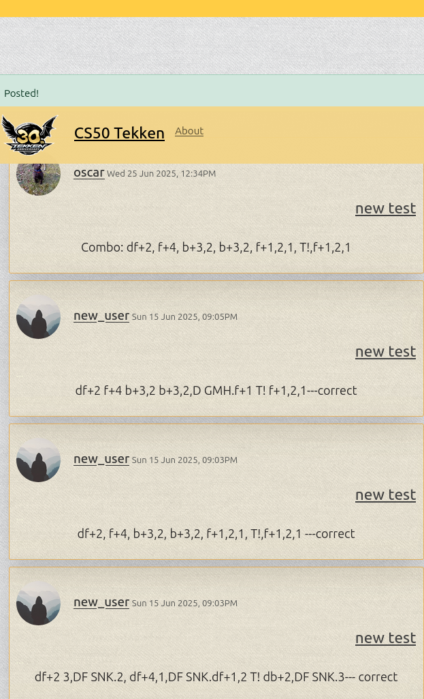

# **Tekken Notation maker + Blog**


#### Video Demo: [video link](youtube.com)

### About:

Final Project for the CS50 Introduction to Python.

### Author:

Askar Mukhanov

***

### To whom it may concern:

The ***`project.py`*** and ***`test_project.py`***
are there just to pass the structure of cs50 submit.

An actual project is flask app that is intiatialized in `run.py` with `create_app()` .

##### Use of AI tools:

I consulted with ai tools only with the goal of learning, the questions that were asked I self restricted into a format of explainig some global topics or very scoped single function problems mostly with `JavaScript`.

I havent requested any fully done solutions, although there might be some ideas, that seeped into my mind unintentionally, due to sometimes ChatGPT would be too "chatty".


***


###  Intro:

Initial idea for this project was to make use of Regular Expression. It was fascinating subject to learn that type of searching algoriths. As a basis for pattern to parse through I've decided to use an aspect of the game Tekken which is **Notations**, specifically how to write its individual moves and combos, as it has quite  a strict ruleset for separating each move with different values.


The game offers a vast library of moves for each game character, and those moves can be stringed together with consequitive or simulteneous button/arcade stick inputs:

Types of inputs include:
* Basic attack buttons
* Combination of attack buttons
* Basic movement input
* Special movement input
* Base and unique stances for each character

On top of that character can be in different state:
* Various state of knockdown
* being thrown
* Stunned
* etc

For many Tekken enthuasists it can be difficult to share knowledge due to complexity
and confusion of how to write notation correctly with tekken lingo. 

This app was built with intent to simplify this process.

### It features:
Parsing through a given string of text, and if written according to ruleset it will generate an image of a combo in  `.png` format for easier recognition.



Convert with **[Text to Image]**  button




#### And vice versa you can input a combo using provided set of visual inputs.


Convert with **[Image to Text]** button




Users can also share their comboes on twitter like feed, if they make an account.




## How it was done:

Originally it was done in CLI interface and would ask for a string of combo and would return either a .jpeg image of a combo or a .pdf file with an image, original notation,  parsed through notation with background of chosen character.

However very quickly I realized two problems with that approach. 

* No one outside of coding knows how to use a terminal 
* It is inconvinient to share your results

So I had a choice either a traditional application with some basic GUI using PyQt / Tkinter package or something that will work straight out of a browser. Due to nature of my goal comboes being shareble, I chose web app approach.

Another  aspect that  pushed me to use web approach was the fact that in past I tried to build flask app, but failed miserably. So I've decided to use `flask` framework for this assignment.

I didn't know that this would be a [rabbit hole](https://en.wikipedia.org/wiki/Alice%27s_Adventures_in_Wonderland) that I'd be falling for the last 3-4 months...

## How the sausage is made:

***

The structure of this project was done with the [**uv** package manager](https://docs.astral.sh/uv/). I learned about it half way  through the project.

`pyproject.toml` contains all of the dependecies.

This app launches from **run.py** file and the app itself is in the package  `pythonblog` that itseslf is segmented into blueprints.

***

In pythonblog package I have `__init__.py`  which instantiate my app itself, SQL database, and  objects from libraries that will be used throught this project: 
```py
mail = Mail()
bcrypt = Bcrypt()
login_manager = LoginManager()
```
the app is instantiated  with a function `create_app(config_file)`
which  takes  Path as an argument using method from Flask `.config.from_pyfile()` and instantiate inddividual blueprints with `.register_blueprint()`

Configuration are in `config.py` file and used using `environmental variables`  that are accessed with `os`.

`models.py` Contains my database models which inherit functionality from SQLAlchemy

And Serializer from `itsDangerous` that Im using for getting tokens for reset password functionality.

***

Two main modules of this app are `main` and `users`.

`templates` as the name suggests, contains all of the htmls that used by Jinja2 templating engine.

`static` is where  all my  assets are.

`errors` and  `posts` are minor features of this  web app, that handle individual common erroneous server responses and individual posts routing.

***

### main

`main` package contains routes and functionality related to my combo parsing methods, as well as forms that are used to submit data to db or for POST methods to go through my parsing "algorithms".

In `routes.py` I have only 2 routes:

`/about` route:
* renders an "About" html 

`/home` route(duplicates to `/` ) 

what it does:
* cleans a folder  holding user generated  combos
* accessing required assets with  `Combo.get_assets()` and `Combo.open_scv()`
* instantiate variable passed from forms
* based on `"GET"` or `"POST"` request.method does differnt things
  * if method  was `"GET"`
    * simply renders a  template with passing `posts` variable to `render_template()` which contains paginated object from  Post model
  * however if method was `"POST"` 
    * depending which id  it  got with `request.form.get("action")`
      * tries to form data to db if its validated
      * except there is an error;; then it return a `flash()` and passing to `render_template()`
      * **
      * tries to generate list from a form data string
      * using `Combo.reverse_parse()` generates a  new string and passing it to form.data
      * except there is an error; then it returns flash()
      *  **
      * gets a string for form data
      * parsing it with `Combo.combo_parse()` 
      * makes an image with `Combo.make_image()`
      * makes a list to  pass to `render_template()` which will be used in `js` for dynamicaly generated image
    * renders a template with `posts` variable which contains paginated object from Post model
  

In `combo.py` I have:

* `combo_parse(combo)`
  * accepts a string of individual tekken moves that is separated by ` single white space` or `.`
  * opens csv file from assets and gets indidual character stances or moves and puts them into a list `special_stance=[]`
  * splits that string into individual  moves  and checks them for "validity" with this pattern `pattern = re.compile(
            rf"^(T!|{special_stance}|{stance}|(?:{motion})?|{motion}{button_input}|({button_input}[~]{motion})|{button_input}|{button_input}*)$"
        )`
  * returns a list of  validated parts with `next` in  between each move
* `make_image(combo_parsed, combo_name)`
  * takes a list that was returned from `combo_parse()` and unique char name that was passed   from submit form
  * combines all moves in list using `PIL` module creates a `.png` image with a traansparent abckground and random name using `secrets.token_hex()`
* `make_preview(combo_parsed)` 
  * takes  a list of parsed results and based on tekken lingo adds correct symbols to each move
  * returns a new list with finalized correct  combo
* `reverse_parse(form_list)`
  * takes a list of moves passed from form
  * using while loop and establishes a counter that will expire on end of list
  * based on previous and next move, transform current move according to tekken lingo
  * returns a string  to  be paassed to form data field 
* `clean_folder()` 
  * cleans a directory containig made combos
* `get_assets()`
  * returns a list of assets to pass used that is passed to  `render_template()`
* `open_csv()`
  * returns a list of individual moves that is passed to `render_template()`

### users

**users** module handles everything related to Users  activities.

It contains `routes.py`, `functions.py` and `forms.py`.

### routes

`routes.py` includes such routes as :
* `/register`
  * if `current_user.is_authenticated` 
    * redirects to `/home`
  * if form checks validation with `.validate_on_submit()`
    * instantiate a variable using `bcryct.generate_password_hash()` based on `form.password.data` field
    * passes a path to  a default image which will be used by `User()`
    * instantiate a  user `User()` model and commits it  to database
    * passing `flash()` message  of success to `render_template()`
    * redirect  to `/login` route
  * otherwise (method  was `"GET"`) renders a template
  * **

* `/login` 
  * if `current_user.is_authenticated`
    * redirects to `/home`
  * if form checks validation with `.valiate_on_submit()`
    * instantiate a user variable using `User()` model which  queries db by first  found `User` object identical to form.email.data
    * checks a hash with `bcrypt.check_password_hash()` 
    * log-ins a user with `login_user()` from `flask_login`
    * redirects to `home` 
  * otherwise `flash()` passes "unsuccesful" message to `render_template()`
  * **

* `/logout`
  * logs-out a user with `logout_user()`
  * redirect to `/home`
  * **

* `/account`
  * requires a check with decorator `login_required`
  *  on `"GET"` method 
     *  renders an account html  passing to form.data value  from `current_user.username` and `current_user.email`
  * on `"POST"` method 
    * checks validity with `.valdiate_on_submit()`
      * instantiate a hexed name with `save_picture(form.picture.data)` which will be a profile picture of the user instead of default
      * commits current user to db
      * passes a positive `flash()` message to `render_template()`
  * **

* `/user/<string:username>`
  * instantiates a user with `User()` model that was got with `first_or_404()` method
  * instantiates a Paginated  `Post()` obbject that  was determined by `backref`, `author=user`
  * renders a template with passed variables
  * **

* `/request_reset`
    * if current_user.is_authenticated
      * redirects `/home`
    * otherwise checks validity of the form with `.validate_on_submit()`
      * instantiates a `User()` object `query.filter_by(email=form.email.data)`
      * sends an email with  Serializer object with `send_email()`
      * redirects to  `/login`
    * **
* `/reset_password/<string:token>`
  * checks if `current_user.is_authenticated` 
    * redirects to `/home`
  * instantiate a user with `User.verify_reset_token(token)`
  * if  form  validates with `.validate_on_submit()`
    * generates a hashed password  with `bcrypt.generate_password_hash(form.password.data)`
    * commits a user to db
    * redirects to `/login`
  
### functions

   `functions.py` contains just two functions that support routing above

  * `send_email()`
    * gets a `sender=` from environment   variable forr `msg`
    * generates a Serializer and send an email with  that `token` using `mail.send(msg)`

  * `save_picture(form_picture)`
    * generates a random name with `secrets.token.hex()`
    * tranforms an image from  `form_picture` using `Image` module from `PIL` to a thumbnail to save space 
    * saves  it to assets folder
    * returns  a path to that image
  
  ### forms

These forms  handle most of "data transfer" between front and backend of my app

They  all  inherit from `Super` which is `FlaskForm`

These forms are  constructed with `flask_wtf` and `wtforms`, including various validators.


* `RegistrationForm()`
  * its fields
    * `username`
    * `email` validates with `Email()`
    * `password`
    * `confirm_password` validates with `EqualTo()`
    * `submit`
  * additional functions `validate_username()` and `validate_email()`. Those use `User.query()` that filter by username  and email and  if user already exist raises `ValidationError()` 
* ***
* `LoginForm()`
  * its fields
    * `email` validates with `Email()`
    * `password`
    * `remember`
    * `submit`
* ***
* `UpdateAccount()`
  * its fields
    * `username`
    * `email`  validates  with `Email()`
    * `picture` accepts on `.jpg` and `.png`  files with `FileAllowed()`  validator
    * `submit` 
  * has same  additional functions as `RegistratioForm`
* **
* `RequestResetForm()`
  * its fields
    * `email` validates with `Email()`
    * `submit`
  * has addition same function `validate_email()`
* **
* `ResetPasswordForm()`
  * its fields
    * `password` 
    * `confirm_password` validates with `EqualTo()`
    * `submit`
  
## Templates

All `htmls` were constructed with the use of  [**Bootstrap**](https://getbootstrap.com/) as well as my owb custom css  that  handles  some unique buttons, backround, and other some `divs` that I wanted to to have everything nested inside follow  same  design  pattern.

They are following a `layout.html` using **jinja2** `extends` and `` `` .

All the pages  have  this simple structure and having `forms=forms` that were passed to `render_template()` constructed with jinja `{{ }}` .

***

Exception to that is  `home.html` , due to having of mixture of handcrafted `<form>` and jinja2 constructed forms with `{{ }}`
its end up a pretty messy page.

While i tried to structure as many of my  html code in readable/"neat"  format, or loop for some repeated content like so:

``` html
<ul class="dropdown-menu">

  <li>
      <a type="button" onclick="set_char('{{ char["moves"]}}')" class="dropdown-item">
        { char["char"] }}
      </a>
  </li>

</ul>
```


***

Due to  my lack of  knowledge of `JavaScript`, `HTML` + `Jinja` inserted functions like `{{ url_for('static' , filename='')}}`I got confused real  fast with multi -layered quotations.

Beside that I failed to organize my  grids row/columns in order how I wanted them to be as a result I end manually writing a lot of it.

```html
<div class="col col-sm-auto">
<div class="container-fluid shadow-lg rounded p-3 mt-3 mb-3 mr-3 ml-3">
   <div class="row row-cols-auto">
      <div class="col p-0">
         <!-- top motion -->
          <a class="btn btn-tekken"  onclick="add_image('{{ url_for('static', filename='assets/ub.png')}}')">
            
          </a>
      </div>
      <div class="col p-0">
         <!-- top motion -->
          <a class="btn btn-tekken" onclick="add_image('{{ url_for("static", filename="assets/u.png") }}')">
            
          </a>
      </div>
      <div class="col p-0">
         <a class="btn btn-tekken" onclick="add_image('{{ url_for("static", filename="assets/uf.png")}}')">
            
          </a>
         <!-- top motion  -->
      </div>

```

 

## JavaScript

At first this was planned ahed to be done without using scripts since I didn't know much about them, however by the I finished with my `combo_parse()` functionality and I started implementing `reverse_parse()`  after adding each button my html page would reload and keep sending `"POST"`. 

So JS it is then.

I wasn't planning to starting to learn from basics and just jumped to documentation of how some of the Classes with JS work, and use of constructor. Some of it was mostly intuitive and reminiscent of Python, a lot of it was very confusing.

This part of my assignment was done with a lot of help from my forums and use of ChatGPT, Copilot(which proven to  be the dumbest) and CS own AI duck  . However as mentioned above I tried to restrict both myself and  ai chat to  provide answers in "teaching" manner and without handout solutions.


At first scripts were done at the bottom of my `home.html`, but they got out of the control real quick and I moved  to its own file.

Every function is created in the same manner declare a `const` and construct a `function`,  a lot  of tutorials use moder method with `->` akin to list comprehension, which proven too confusing if one  doesn't knwo basics, so they all constsruted "old  way"

Here are some of the functions:
* `add_image(path)`
  * this function targets a `div`  by its `id` and append to that div a child `img` which `src=` would be a path given with jinja `url_for()` 
  * then adds that path to a global  const array called `list_pass`, this array will be used in another function
  * this function was used a in almost all handcrafted buttons that trigger this function  with  `onclick=""`
* `send_list()`
     * this function targets a hidden form `input`
     * "puts" `list_pass` into that form
     * afterwards that input form has a unique name that will trigger specific control flow that will use `reverse_parse()` on that value/data of that form
* `set_char(moves)`
  * target a `div` by its `id`
  * this function accepts a string 
  * splits it by `,` thus creating an array
  * using `forEach` creates a `button` element that will have multiple required attributes specifically  `onclick=""` with mentioned above function `add_image()` and path that is needed for that function, will be constructed out of each item in created array string
  * then adds that new `button` element to a targeted `div`
* there are other small supporting functions that do little QoL things:
  * `copy_mail()` copy my email in About page
  * `delete_last()` clears last `img` in preview `div`
  * `delete_all()` clears all images in preview `div`
  * `clear_field()` clears input form
  * `fill_field()` an old function that was done before `add_image()`, planning to use it in another way
  * `left_key_click()` event listener that triggers a button by its id
  * `right_key_click()` ~

***
## Goals for this project:

* Implement URL parsing
  * give URL and it gives back every matching to my combo regex
* Integration to Discord or Twitch
  * maybe*


Half way through a project things got very complicated and my backup methods were not sufficient and I learned some basics of GIT VSC,  as well got a bit more familiar with github.

## Foreword

I'm proud what with the results of this project, I have solidified lessons I learned from the CS50 course, concepts of different loop, that I understood before, now i have a solid  grasp upon. The OOP structure that I had difficulties with getting on, now a lot more clearer.

What I've learned:

* Working with documentations
* Working with my Text Editors and IDE, throught this I tried PyCharm, VSCode and Sublime Text
* Working with Terminal(I'm not afraid anymore🙃)
* Working with different packages:
  * `pathlib` and construstion of Paths
  * `re`
  * `os`
  * `pillow`
  * `secrets`
  * `timedate`
* Flask framework
  * Clear understanding of how routes work
  * Templating
  * Basic HTML
  * `Mail` module
  * `wtforms`
  * Login system
  * `request` , `url_for` and `redirect`
  * tokenization of sensitive data
* Custom CSS and Bootstrap
* RE in general, I started to use it in my daily activities
* I got better understing of SQL with sql-alchemy
  * I had prior experience with MYSQL, but it was indirect and I didn't understand how queries work
* OOP approach
  * I got more comfortable with creating Classes and use of methods and objects (not so much with  decorators)
  
* Minor introduction into Javascript
* Use of environmental variables
*  Clear understanding of basics of version control with GIT CLI
  

 On the side note I tried Linux and I  don't think I'm coming back to Windows. Thanks for all the fish🐬


## Acknowledgements

This project was based on my files of the first  attemp of learning Python, at a time I naively assumed flask is basics of Python. I was following the tutorial of Corey MS in his Flask Course, this was 2-3 years ago and that turorial is 7-8 years old now. That tutorial I  believe is based on flask 1.0 release.

I was contemplating if this violates the ethical rules of cs50 course before starting this project, however by the end of it,  I personally believe the goal of actually learning through practical approach was achived for me.

That said here are the giants:
  * ### CS50 [YouTube](https://www.youtube.com/cs50) (Personnal thanks to Prof. David Malan)
  * ### Corey Schafer : [YouTube](https://www.youtube.com/@coreyms/featured)  -  [web](https://coreyms.com/)
  * ###  Bro Code  :  [YouTube](https://www.youtube.com/@BroCodez) 
  